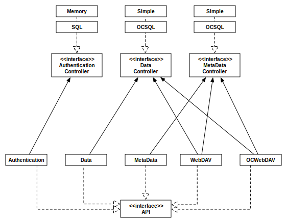

# Developer

This component provides the APIs to manage your storage. It has been designed
to be scalable and very flexible in order to extend its features. The official
APIs exposed by this server are the following:

* **Authentication API**: this API authenticates an user with an username and
password against the configured authentication controller (memory, sql,
ldap). ClawIO does not offer user management capabilities (creating, deleting,
updating users), because we think that user management must  be done using
existing services like LDAP, Active Directory or custom in-house user
management services.

* **Data API**: this API manages the upload and download of binary files. The
data controllers available at these moment just work with local filesystems.

* **MetaData API**: this API manages all the operations realated to metadata
manipulation: creating directories, moving and renaming files and deleting
resources. The metadata controllers at this moment just work with local
filesystems.

* **WebDAV API**:  this API exposes a WebDAV endpoint to WebDAV clients like
Finder MacOS, CyberDuck, Cadaver and other WebDAV compliant applications.

* **OCWebDav API**: this API increases the WebDAV API to implement the
ownCloud Synchronization Protocol.  ownCloud sync clients can be connected to this API
to synchronize the data stored on ClawIO.

The UML class diagram  shows the interfaces that can be implemented to extend ClawIO and also the 
already available implementations.

## Data model

ClawIO works with objects. An object can be a tree or a blob. This terminology comes from [Git internal data model](https://git-scm.com/book/en/v2/Git-Internals-Git-Objects).

- A blob object is the the binary representation of some information.
- A tree object is a container of objects.

Now you may wonder, why to not use the terms file and folder/directory ?

The answer is that filesystems have evolved.

On local laptops and workstations we are used to store our data onto local
filesystems that have the notion of files and folders, but "in the cloud" new
storage solutions like object storages have rised and are here to stay as they 
offer a cheap and scalable alternative solution to local filesystems. [Amazon S3](https://aws.amazon.com/s3://aws.amazon.com/s3/)
and [OpenStack Swift](http://docs.openstack.org/developer/swift/) are the most notorious cases.

Object storages  only store blobs, so one has to be very creative to implement filesystem hierarchical functionality on top of them. 
The [H-flat](https://github.com/Seagate/h-flat) project shows how to implement this hierarchical functionality on top of a flat namespace.

Also, a blob does not need to be mapped to a file, it can also be an
in-memory representation of some information or a stream of data. One could implement a 
Spotify data and metadata controller for ClawIO, where trees are albums and blobs are songs streamed directly from the Spotify API. You got the idea.
