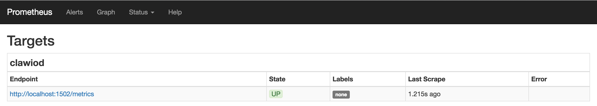
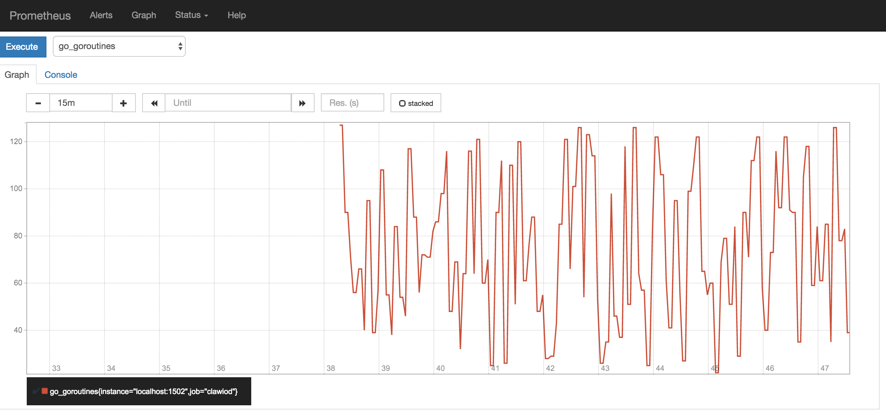

# Monitoring

ClawIO exposes metrics by default about the server itself (memory, cpu load,
number of threads...) and also from its API (request method, duration, errors...).

To check the metrics go to http://localhost:1502/metrics and you should obtain an output similar to this:

```
# HELP go_gc_duration_seconds A summary of the GC invocation durations.
# TYPE go_gc_duration_seconds summary
go_gc_duration_seconds{quantile="0"} 6.6579e-05
go_gc_duration_seconds{quantile="0.25"} 0.00017957000000000002
go_gc_duration_seconds{quantile="0.5"} 0.000244594
go_gc_duration_seconds{quantile="0.75"} 0.000661054
go_gc_duration_seconds{quantile="1"} 0.009960395
go_gc_duration_seconds_sum 0.014757445000000001
go_gc_duration_seconds_count 16
# HELP go_goroutines Number of goroutines that currently exist.
# TYPE go_goroutines gauge
go_goroutines 33
# HELP go_memstats_alloc_bytes Number of bytes allocated and still in use.
# TYPE go_memstats_alloc_bytes gauge
go_memstats_alloc_bytes 8.988488e+06
# HELP go_memstats_alloc_bytes_total Total number of bytes allocated, even if freed.
# TYPE go_memstats_alloc_bytes_total counter
go_memstats_alloc_bytes_total 8.5737784e+07

```
The metrics are there but it is quite difficult to see what is happening on our server.

Fortunately, ClawIO exposes metrics understandable by
[Prometheus](https://prometheus.io/), a revolutionay and leading open-source
monitoring solution, that will inject these ugly data in a high dimensional
time series data model that we can query.

## Installing and configuring Prometheus

Download the [latest release of Prometheus](https://prometheus.io/download/) for your platform, then extract and run it:

```bash
tar xvfz prometheus-*.tar.gz
cd prometheus-*
```

Save the following basic Prometheus configuration as a file named `prometheus.yml`:

```yml
global:
  scrape_interval:     15s
  external_labels:
    monitor: 'clawiod-demo-monitor'

scrape_configs:
  - job_name: 'clawiod'
    scrape_interval: 5s
    target_groups:
      - targets: ['localhost:1502']
```

To start Prometheus with your newly created configuration file, change to your Prometheus build directory and run:

```bash
# Start Prometheus.
# By default, Prometheus stores its database in ./data (flag -storage.local.path).
./prometheus -config.file=prometheus.yml

INFO[0000] Starting prometheus (version=0.20.0, branch=master, revision=aeab25c)  source=main.go:73
INFO[0000] Build context (go=go1.6.2, user=root@77050118f904, date=20160616-08:40:41)  source=main.go:74
INFO[0000] Loading configuration file prometheus.yml     source=main.go:206
WARN[0000] The 'target_groups' option for scrape configurations is deprecated, use 'static_configs' instead  source=config.go:468
INFO[0000] Loading series map and head chunks...         source=storage.go:341
INFO[0000] 0 series loaded.                              source=storage.go:346
WARN[0000] No AlertManagers configured, not dispatching any alerts  source=notifier.go:174
INFO[0000] Listening on :9090                            source=web.go:241
INFO[0000] Starting target manager...                    source=targetmanager.go:74
...
```
Prometheus should start up and it should show a status page at http://localhost:9090. Give it a couple of seconds to collect data from clawiod. If you do not
see data coming, play a little bit with ClawIO issuing some cURL requests or from some of the available clients.


Go to http://localhost:9090/targets and you should see the clawiod target in the **UP** state:



Now go to http://localhost:9090/graph, choose `go_goroutines` from the
selection dropdown and click *execute*. Then click the *Graph* tab close to the
*Console* tab and you should obtain something similar to this:



Prometheus is a powerful tool and we recommend you to take a look to the [Prometheus Docs](https://prometheus.io/docs/introduction/overview/) to unleash its power.

**Installing and configuring Grafana**


The Prometheus visual dashboard, although functional, it is not quite beautiful.
Fortunately, Prometheus data can be exported to other visualization tools.

Grafana is a beautiful metric & analytic dashboard, check the [Grafana
Demo](http://play.grafana.org/dashboard/db/big-dashboard) to see what we are
talking about. Grafana supports querying a Prometheus server. 

For the full and official Grafana installation instructions, see the [official Grafana documentation]().

Check the following links to integrate Grafana with Prometheus:

- [https://prometheus.io/docs/visualization/grafana/](https://prometheus.io/docs/visualization/grafana/)
- [http://docs.grafana.org/datasources/prometheus/](http://docs.grafana.org/datasources/prometheus/)
