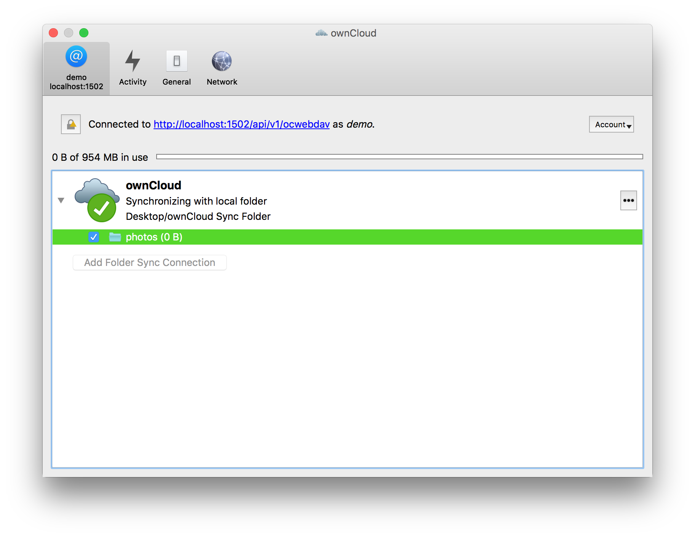

# ownCloud Synchronization

ClawIO implements the [OSP (ownCloud Synchronisation Protocol)](https://github.com/cernbox/smashbox/blob/master/protocol/protocol.md)
in its OCWebDAV API.

The OSP requires special logic when handling data and metadata operations, and for such reason, it is required to use specialized data and metadata 
controllers. These controllers start with the prefix *oc*, and the only current implemntation is the "ocsql" data and metadata controllers, that use a MySQL/MariaDB database to handle the semantics of the protocol.

## Enabling the OCWebDAV API
In the configuration file add the `ocwebdav` API to the list of enabled services.

```json
{
  "server": {
    "enabled_services": [
      "authentication",
      "metadata",
      "data",
      "webdav",
      "ocwebdav"
    ],
  }
}
```

You also need to use a data and metadata controller which name starts with *oc*, otherwise ownCloud clients will not being
able to connect. Refer to the [Storage Section](../storage/README.md) to learn how to configure the data and metadata controller. 

Once you have everything setup you should being able to connect with the ownCloud Desktop clients.

## Connecting to ClawIO from ownCloud Desktop Client

Open your client and enter the location of your server.


Enter your credentials.


Choose your local folder and you remote folder.


Now you will being able to synchronize your data using the ownCloud sync clients.


