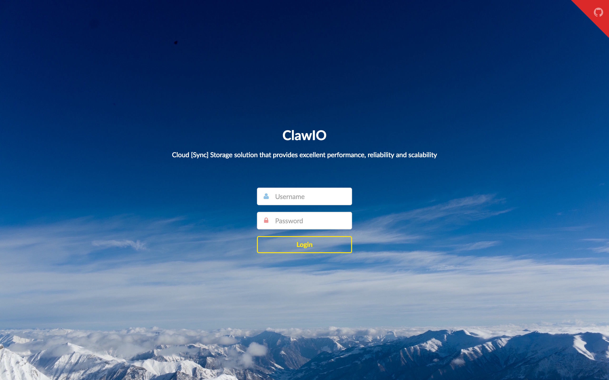
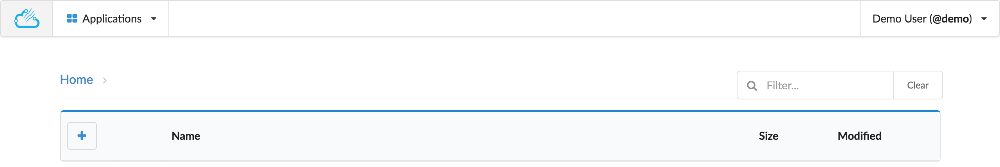

# Home deployment

The home deployment is targeted to personal use in a local network.

## Requirements

* Have Nginx installed

## Installing and running the ClawIO daemon

Download the latest release of clawiod for your platform, then extract and run it:

```bash
tar xvfz clawiod-*.tar.gz
cd clawiod-*
```

Create a configuration file that contains at least the following information,
we will call it `clawiod.conf`:

```json
{

  "server": {
    "jwt_secret": "<your secret token>",
    "http_access_log": "<your file to store http logs>",
    "app_log": "<your file to store app logs>",
  },

  "authenticaton": {
    "memory": {
      "users": [
        {
          "display_name": "<your display name>",
          "email": "<your email>",
          "password": "<your password>",
          "username": "<your username>"
        }
      ]
    },
  },

  "metadata": {
    "simple": {
      "namespace": "<your path where data will be stored>",
      "temporary_namespace": "<your path to store temporary data>"
    },
  },


  "data": {
    "simple": {
      "namespace": "<same as metadata simple namespace>",
      "temporary_namespace": "<same as metadata temporary_namespace>"
    },
  },
}
```


To start the server, change to your clawiod build directory and run:

```bash
nohup ./clawiod -config clawiod.conf &
```

The daemon should start listening on port 1502.

# Installing and running the Web UI

Download the latest release of `webui` and uncompress it:

```bash
tar xvfz webui-*.tar.gz
```

We will use NGINX as our web server so you must have it already installed.
Create an NGINX configuration file, we will call it `nginx.conf` with the following contents:

```nginx
server {
	listen 80 default_server;
	listen [::]:80 default_server;

	root /usr/share/nginx/html;
	index index.html;

	location / {
		try_files $uri $uri/ /index.html;
	}
}
```
Then perform the following actions:

* Copy the `nginx.conf` file to `/etc/nginx/conf.d/default.conf`
* Copy the contents of the `webui-*` folder to `/usr/share/nginx/html/`

If you go to [http://localhost:80](http://localhost:80) you should see the login page.



After entering your credentials, you will be presented with the state of your home directory:



Play with the interface and upload some content:
