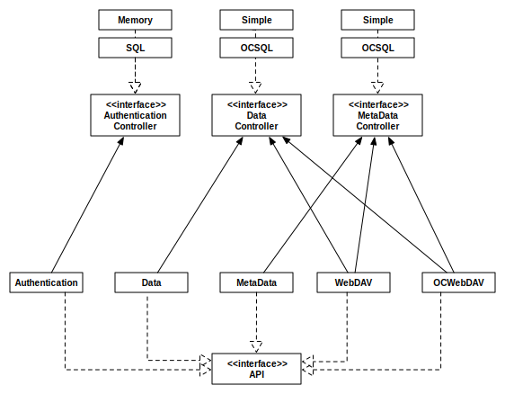

# ClawIO Server Daemon (clawiod)

This component provides the APIs to manage your storage. It has been designed
to be scalable and very flexible in order to extend its features. The official
APIs exposed by this server are the following:

* **Authentication API**: this API authenticates an user with an username and
password against the configured authentication controller (memory, sql,
ldap). ClawIO does not offer user management capabilities (creating, deleting,
updating users), because we think that user management must  be done using
existing services like LDAP, Active Directory or custom in-house user
management services.

* **Data API**: this API manages the upload and download of binary files. The
data controllers available at these moment just work with local filesystems.

* **MetaData API**: this API manages all the operations realated to metadata
manipulation: creating directories, moving and renaming files and deleting
resources. The metadata controllers at this moment just work with local
filesystems.

* **WebDAV API**:  this API exposes a WebDAV endpoint to WebDAV clients like
Finder MacOS, CyberDuck, Cadaver and other WebDAV compliant applications.

* **OSP WebDav API**: this API increases the WebDAV API to implement the
ownCloud Synchronization Protocol.  ownCloud sync clients can be connected to this API
to synchronize the data stored on ClawIO.

The UML class diagram  shows the interfaces that can be implemented to extend ClawIO and also the 
already available implementations.

