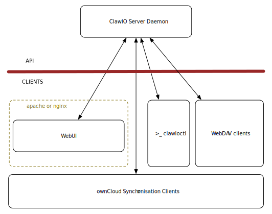

# ClawIO Components

ClawIO consists of the following components:

* [WebUI](https://github.com/clawio/webui): the WebUI is a single page
  application (SPA) built with HTML5, CSS3 and JS. As it is a self-contained
client-side application it can be deployed on any web server (NGINX, Apache ...). It uses the Ember JS framework 
to have a modular structure. This component is the presentation layer and it is completely decoupled from the server logic, it only sends AJAX requests to 
the ClawIO API.

* [ClawIO Server Daemon](https://github.com/clawio/clawiod): this server exposes the ClawIO APIs. It handles data upload and download and metadata operations. 
It also exposes a WebDAV endopoint and an ownCloud Synchronisation Protocol endpoint to synchronise data using ownCloud clients. The daemon can be configured
to only expose a subset of the APIs, thus giving the posibillity to create a
cluster of services completely decoupleted in favour of a more microservices
oriented design.

* [ClawIO Controller](https://github.com/clawio/clawioctl): this is a CLI tool that allows you to interact with the ClawIO API from a terminal.

* [ClawIO SDK](https://github.com/clawio/sdk): this SDK is the official Go ClawIO SDK to create your own applications without having to deal with raw HTTP requests.
The clawioctl tool uses this SDK.

The architecture shown below highlights how these components are used in an standalone layout:

