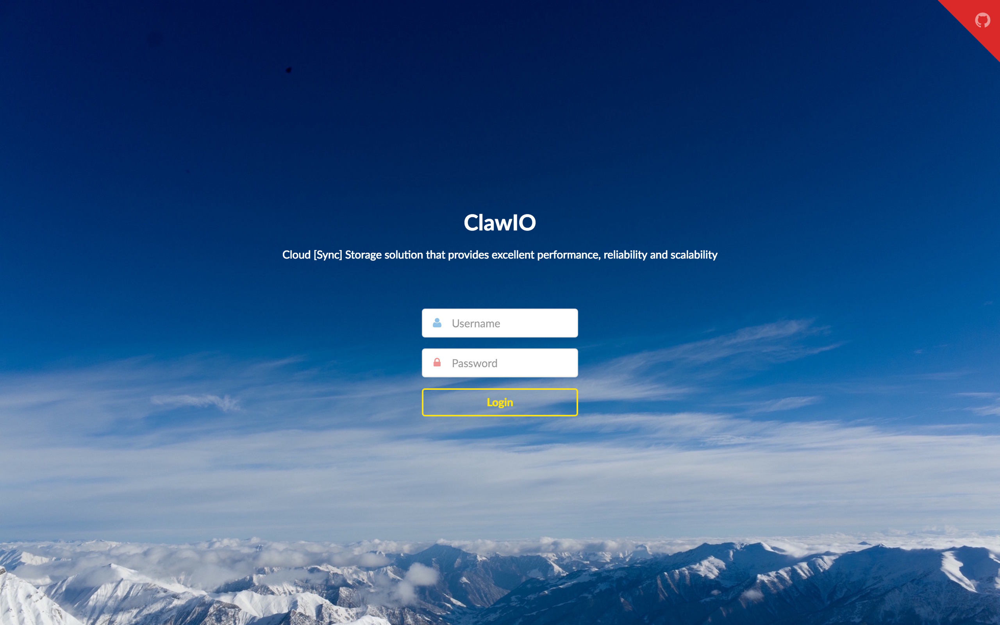
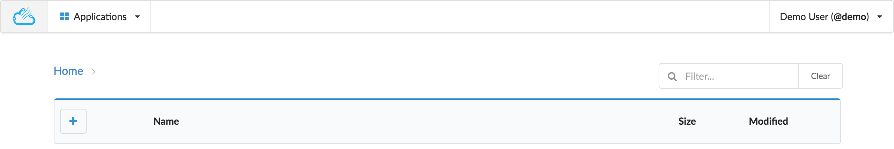

# WebUI 

Download the latest release of `webui` and uncompress it:

```bash
tar xvfz webui-*.tar.gz
```

We will use NGINX as our web server so you must have it already installed.
Create an NGINX configuration file, we will call it `nginx.conf` with the following contents:

```nginx
server {
	listen 80 default_server;
	listen [::]:80 default_server;

	root /usr/share/nginx/html;
	index index.html;

	location / {
		try_files $uri $uri/ /index.html;
	}
}
```
Then perform the following actions:

* Copy the `nginx.conf` file to `/etc/nginx/conf.d/default.conf`
* Copy the contents of the `webui-*` folder to `/usr/share/nginx/html/`

If you go to [http://localhost:80](http://localhost:80) you should see the login page.



After entering your credentials, you will be presented with the state of your home directory:



Play with the interface and upload some content:
