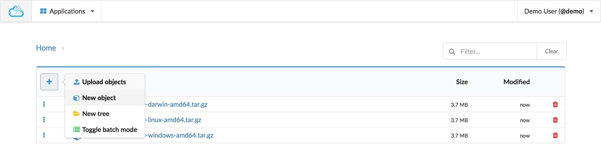
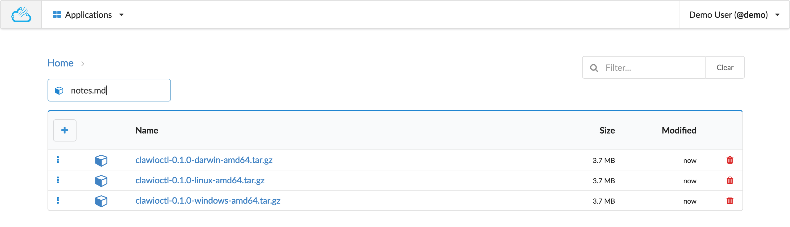
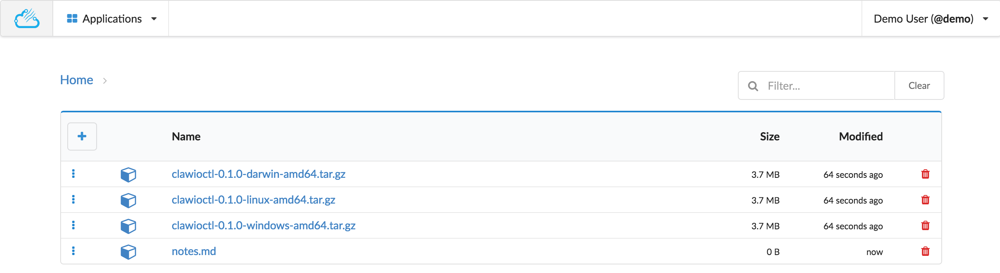

# Create Object

From the actions menu, choose the `New object` action.

You will be presented witn an input box where you can type the name of your new object.

Type the Enter key to confirm the creation of hit the Escape key to abort the creation.

