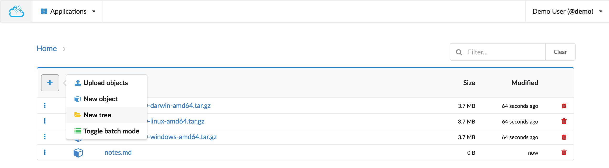
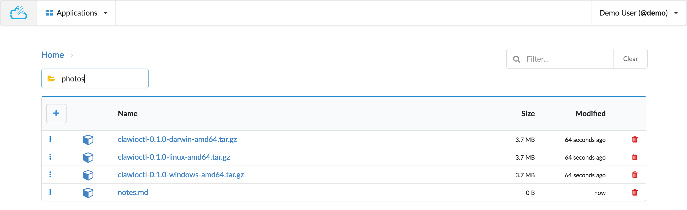
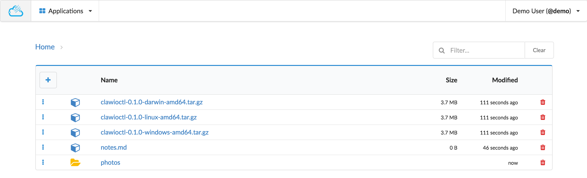

# Create Tree

From the actions menu, choose the `New tree` action.

You will be presented with an input box where you can type the name of your new tree.

Type the Enter key to confirm the creation of hit the Escape key to abort the creation.

