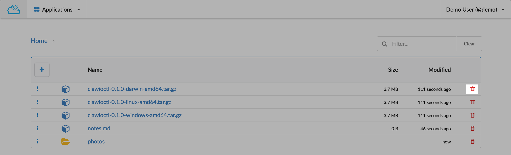
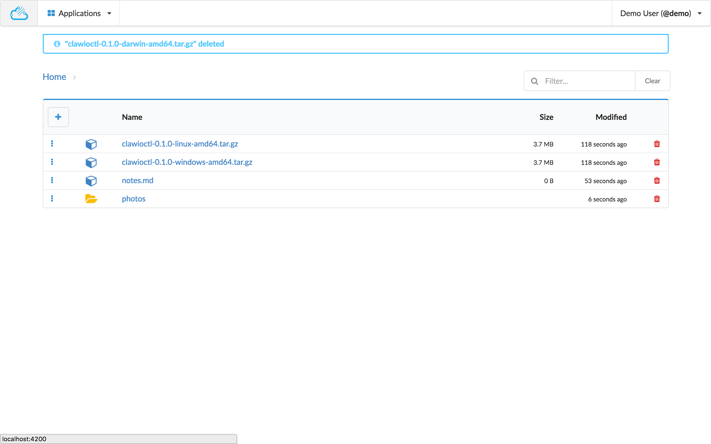

# Delete Object

You can delete an object (blob or tree), clicking in the red bin icon on the right side of the object you want to delete.

A message will appear on the top to inform you about the deletion.

